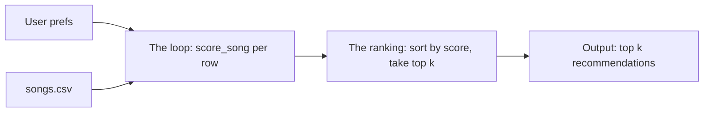

# 🎵 Music Recommender Simulation

## Project Summary

In this project you will build and explain a small music recommender system.

Your goal is to:

- Represent songs and a user "taste profile" as data
- Design a scoring rule that turns that data into recommendations
- Evaluate what your system gets right and wrong
- Reflect on how this mirrors real world AI recommenders

Replace this paragraph with your own summary of what your version does.

---

## How The System Works

Real recommendation platforms like Spotify or YouTube typically combine
collaborative filtering (predicting taste from what similar users liked) with
content-based filtering (comparing item attributes to what a user already
likes), often blending in contextual signals to handle new items with no
history yet. This simulation focuses on a simplified content-based approach:
the `Recommender` compares each song's attributes (genre, mood, energy,
acousticness) against a single user's stated `UserProfile`, scoring
categorical features as matches/non-matches and numeric features by closeness
to the user's target rather than by raw magnitude, prioritizing a
transparent, hand-designed baseline over any learned model.

### Song features used
- `genre` — categorical match against user's favorite genre
- `mood` — categorical match against user's favorite mood
- `energy` — numeric closeness match against user's target energy
- `acousticness` — numeric, used as a bonus/penalty modifier based on user preference

(`tempo_bpm`, `valence`, and `danceability` are present in the dataset but
excluded from this initial scoring model — `tempo_bpm` overlaps heavily with
`energy`, and `valence`/`danceability` have no corresponding field in
`UserProfile` to compare against.)

### UserProfile features used
- `favorite_genre` — user's preferred genre, compared against `Song.genre`
- `favorite_mood` — user's preferred mood, compared against `Song.mood`
- `target_energy` — user's preferred energy level, compared by closeness against `Song.energy`
- `likes_acoustic` — boolean preference, applied as a bonus/penalty against `Song.acousticness`

### Algorithm recipe

Each song is scored against the user's profile using the following point system:

- **Genre match**: +2.0 points if `song.genre == user.favorite_genre`, else 0
- **Mood match**: +1.0 point if `song.mood == user.favorite_mood`, else 0
- **Energy similarity**: `2.0 * (1 - |song.energy - user.target_energy|)` —
  rewards songs whose energy is *close* to the user's target, not just high energy
- **Acoustic modifier**: +0.5 if the user likes acoustic songs and
  `song.acousticness > 0.6`; -0.5 if the user dislikes acoustic songs and
  `song.acousticness > 0.6`; 0 otherwise

Maximum possible score: 5.5 points. Songs are scored individually (the
Scoring Rule), then all scored songs are sorted highest-to-lowest and cut to
the top `k` (the Ranking Rule) to produce the final recommendation list.

### Data flow



### Expected biases
This system likely over-prioritizes genre, since it carries the highest
fixed weight (2.0) and is an all-or-nothing match — a song in an adjacent
genre (e.g. "indie pop" for a "pop" fan) gets zero genre credit even though
it might suit the user well, while a mood match alone can't make up the
difference. The recipe also has no way to express dislike of specific
genres or moods, only affinity, so an actively disliked genre scores the
same (zero) as one the user is simply neutral about. Finally, because
`favorite_genre` and `favorite_mood` are exact-string matches, the system is
sensitive to labeling inconsistencies in the source data (e.g. "hip-hop" vs.
"hip hop") that a human listener wouldn't notice as a meaningful difference.

---

## Getting Started

### Setup

1. Create a virtual environment (optional but recommended):

   ```bash
   python -m venv .venv
   source .venv/bin/activate      # Mac or Linux
   .venv\Scripts\activate         # Windows

2. Install dependencies

```bash
pip install -r requirements.txt
```

3. Run the app:

```bash
python -m src.main
```

### Running Tests

Run the starter tests with:

```bash
pytest
```

You can add more tests in `tests/test_recommender.py`.

---

## Sample Recommendation Output


```
Loading songs from data/songs.csv...
Loaded songs: 18

====================================================================================================
User profile: {'genre': 'pop', 'mood': 'happy', 'energy': 0.8}
====================================================================================================

Top Recommendations:

1. Sunrise City by Neon Echo  —  Score: 90.2%
   Because: genre match (pop) (+2.0); mood match (happy) (+1.0); very close energy match (+1.96)

2. Gym Hero by Max Pulse  —  Score: 68.0%
   Because: genre match (pop) (+2.0); very close energy match (+1.74)

3. Rooftop Lights by Indigo Parade  —  Score: 53.1%
   Because: mood match (happy) (+1.0); very close energy match (+1.92)

4. Night Drive Loop by Neon Echo  —  Score: 34.5%
   Because: very close energy match (+1.9)

5. Storm Runner by Voltline  —  Score: 32.4%
   Because: very close energy match (+1.78)
```

**Screenshot or video** *(optional)*: <!-- Insert a screenshot or demo video link here -->

---

## Experiments You Tried

Use this section to document the experiments you ran. For example:

- What happened when you changed the weight on genre from 2.0 to 0.5
- What happened when you added tempo or valence to the score
- How did your system behave for different types of users

---

## Limitations and Risks

Summarize some limitations of your recommender.

Examples:

- It only works on a tiny catalog
- It does not understand lyrics or language
- It might over favor one genre or mood

You will go deeper on this in your model card.

---

## Reflection

Read and complete `model_card.md`:

[**Model Card**](model_card.md)

Write 1 to 2 paragraphs here about what you learned:

- about how recommenders turn data into predictions
- about where bias or unfairness could show up in systems like this


